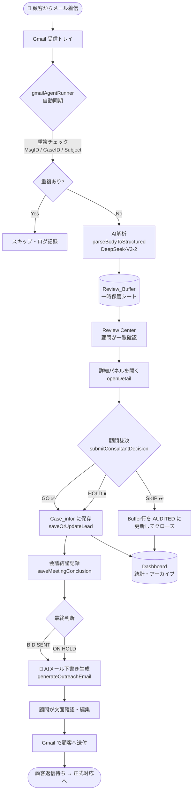
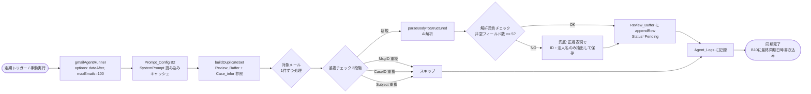
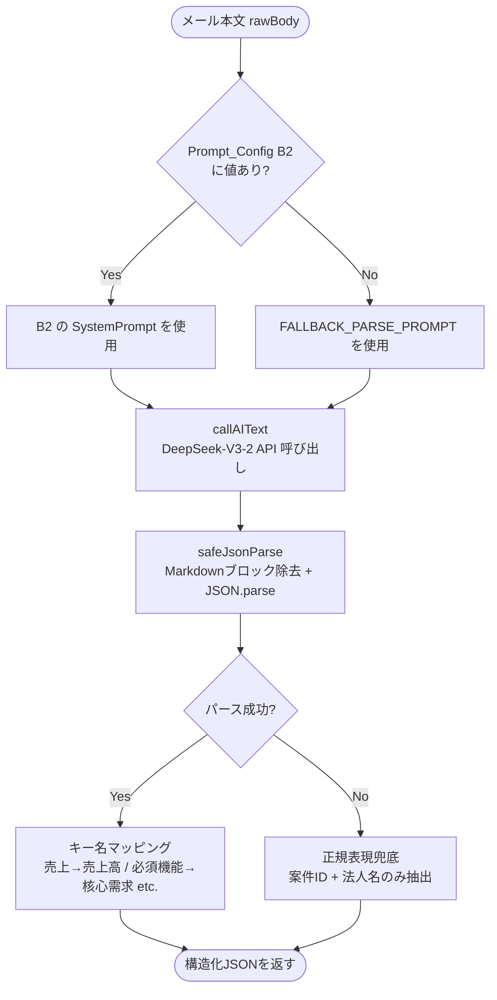
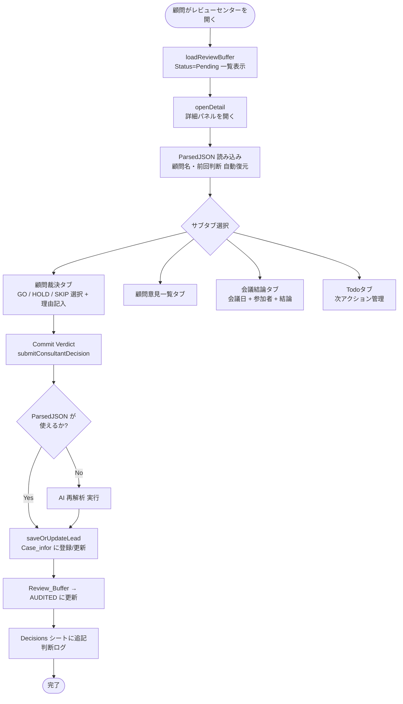
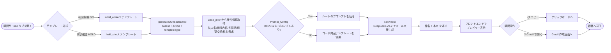
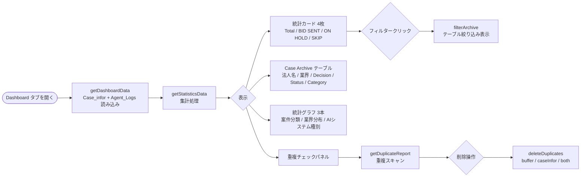
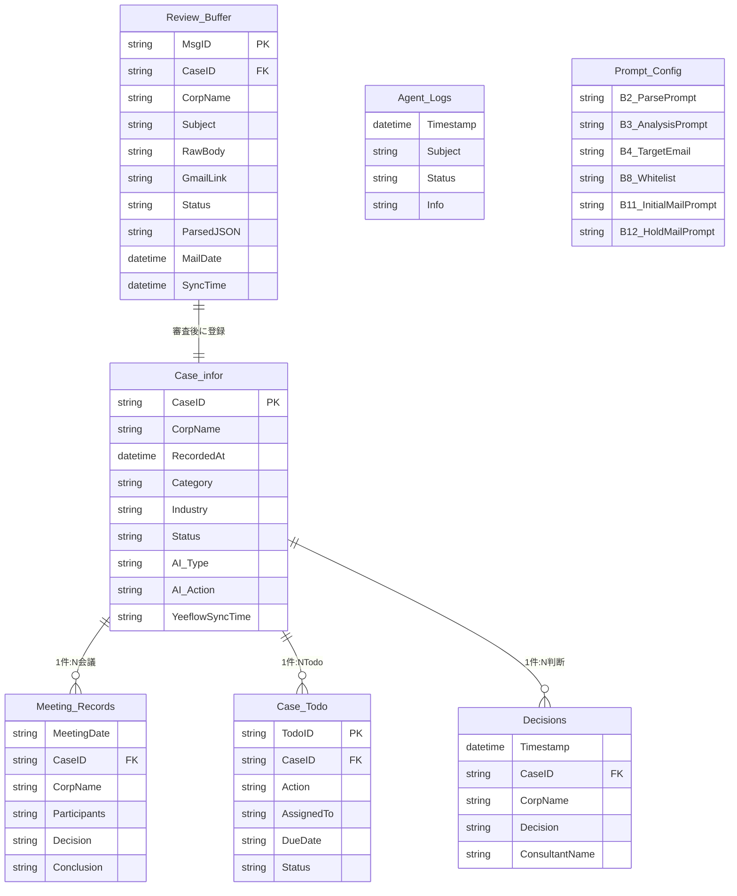

# Ready Crew CRM — 業務フロー図（V10.5.0）
> 最終更新: 2026-05-07

---

## 1. 全体フロー概要



---

## 2. Gmail 自動同期フロー



---

## 3. AI メール解析フロー（parseBodyToStructured）



---

## 4. 顧問裁決フロー（Review Center）



---

## 5. AIメール下書き生成フロー



---

## 6. Dashboard & 統計フロー



---

## 7. データシート関係図



---

## 8. システム権限・アクセス制御

```mermaid
flowchart TD
    A([ユーザーがアクセス]) --> B[checkAccess\nGAS doGet]
    B --> C{getActiveUser\nメール取得}
    C -->|失敗 execute-as-me| D[放行 anonymous]
    C -->|成功| E{ドメイン確認\n@terabox.jp ?}
    E -->|No| F[🔒 Access Denied 画面]
    E -->|Yes| G{Prompt_Config B8\n白名単あり?}
    G -->|なし| H[ドメイン認証のみで通過]
    G -->|あり| I{メールが白名単に含まれる?}
    I -->|No| F
    I -->|Yes| H
    H --> J[index.html を返す\nReady Crew CRM]
```

---

## 主要バージョン変遷サマリー

| バージョン | 主な変更内容 |
|---|---|
| V9.8.x | AI解析品質向上・重複検出3段階・Re-parse機能追加 |
| V9.9.8 | Yeeflow CRM 一括同期機能追加 |
| V10.4.1 | 会議結論をメール生成に統合・HOLDバグ修正 |
| V10.5.0 | Yeeflow 直接API同期・会議結論 → Case_infor自動反映 |
